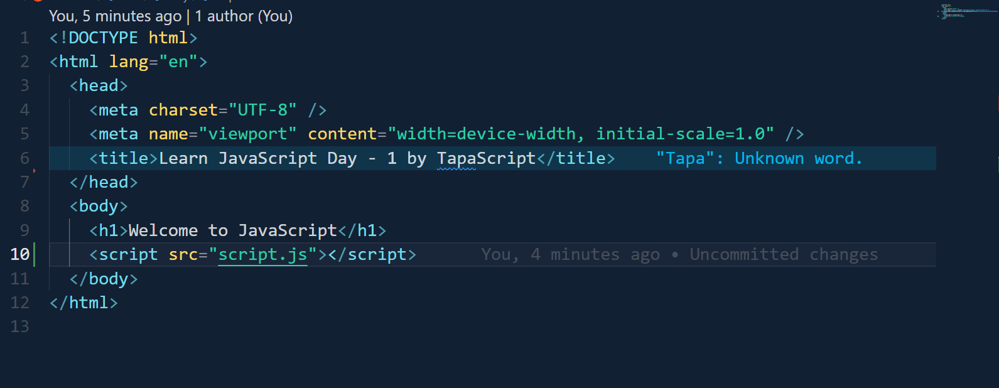
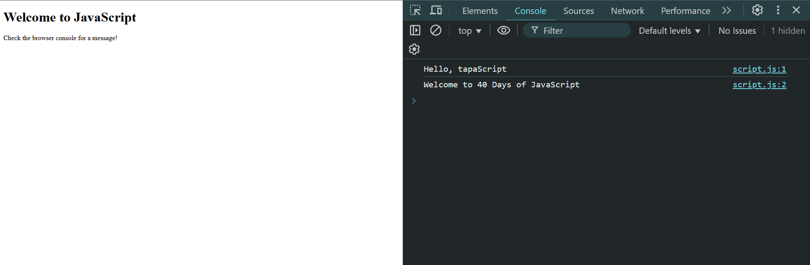
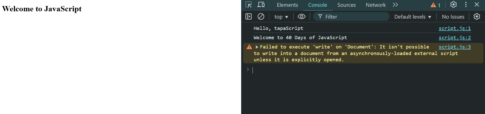

# Day 01 - 40 Days of JavaScript ✅

## 👩‍💻 🧑‍💻 Assignment Tasks

### ✅ Task 1: Setting Up Your Environment

1. Install VS Code (if not installed) (Done ✅).
2. Set up Live Server or open the HTML file directly in a browser (Done ✅).
3. Open the DevTools Console (Right-click → Inspect → Console) (Done ✅).

### ✅ Task 2: Write Your First JavaScript Code

1. Create a new file: index.html.
2. Add a `<script>` tag inside the HTML file or link an external `script.js`.
3. Inside `script.js`, write a simple greeting program:
   ```js
   console.log("Hello, tapaScript!") ✅;
   console.log("Welcome to 40 Days of JavaScript!") ✅;
   document.write("Check the browser console for a message!") ✅;
   ```
4. Run the HTML file in the browser and check:

- The console log prints the text. ✅
- The document.write() outputs text on the webpage. ✅

- The console log prints the text. ✅

---


---


---

### ✅ Task 3: Experiment with Different JavaScript Loading Methods - (Done ✅)

1. Add the script in `<head>`, end of the `<body>` tag.

## When Script Tag using Head Tag

## Code


## Output


## When Script Tag using Body End

## Code



## Output



2. Use `async` and `defer` attributes

## When heading and end of body tag I using async and defer in script tag output given Same Error .

## Code


## Output



3. Understand the difefrences.

- [x] when I using heading tag in script tag then `document.write` tag output showing top.
- [x] when I using end of body tag is script tag then `document.write` tag output showing html tag bottom .

- [x] when I using `async and defer` in script tag `document.write` tag not execute showing error message
