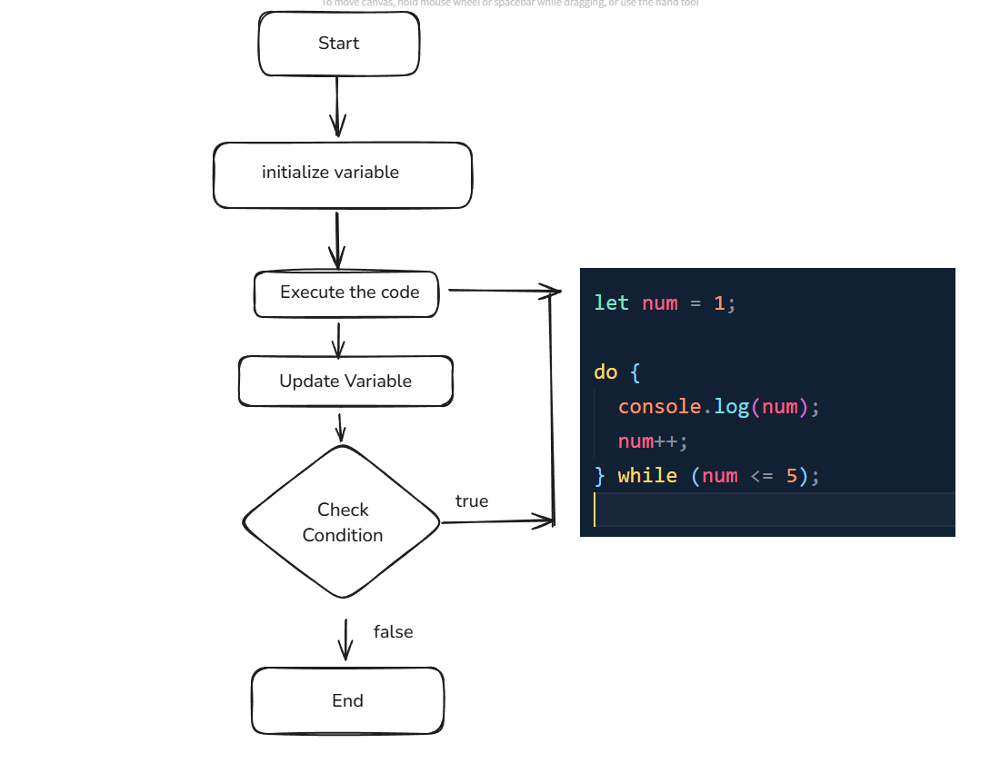

# Write your understanding on the difefrences between for, while, and do-while loop. Create their flow charts.

# 01. For Loop

- For loop is best when we know exactly how many times we need to run a block of code .

### Flow Chart :

# 02 . While Loop

-A while loop runs as long as a given condition is true . It’s best when we don’t know in advance how many iterations are needed .

### Flow Chart :

# 03. Do-While-Lop

- A do while loop ensures that the code executes at least once before checking the condition .

### Flow Char :

